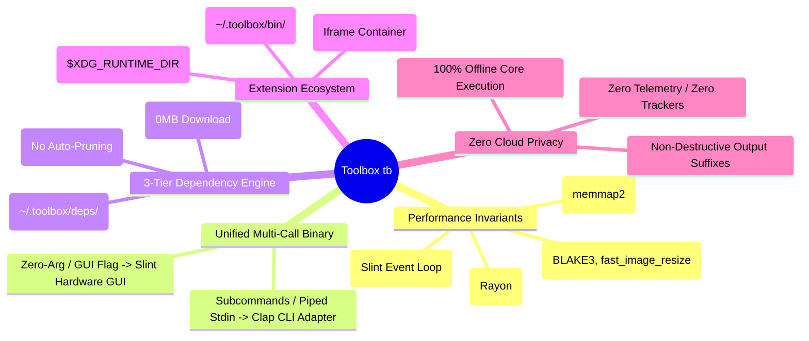
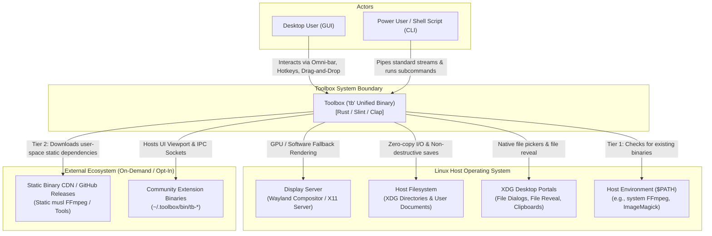
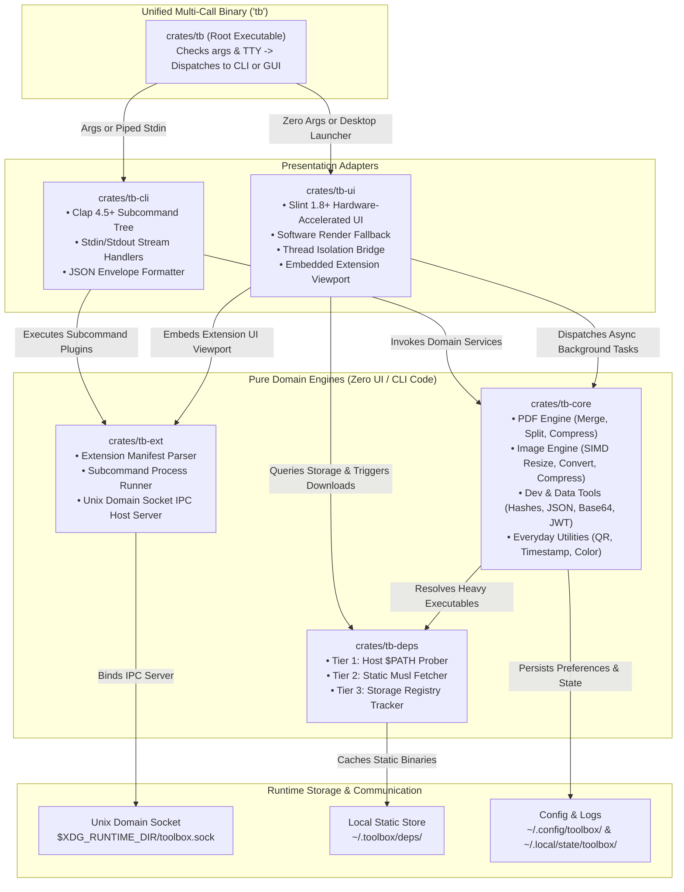
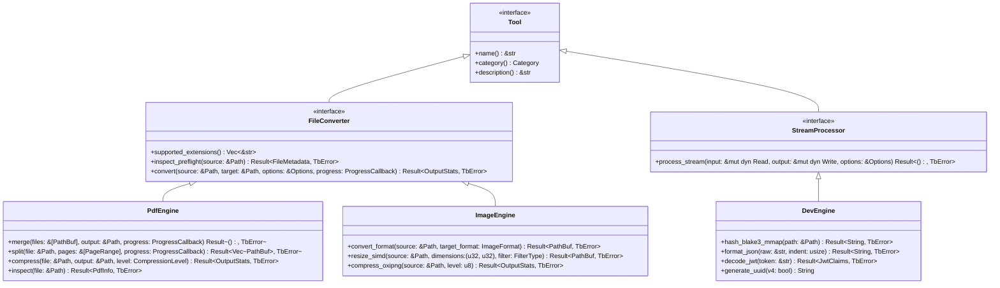
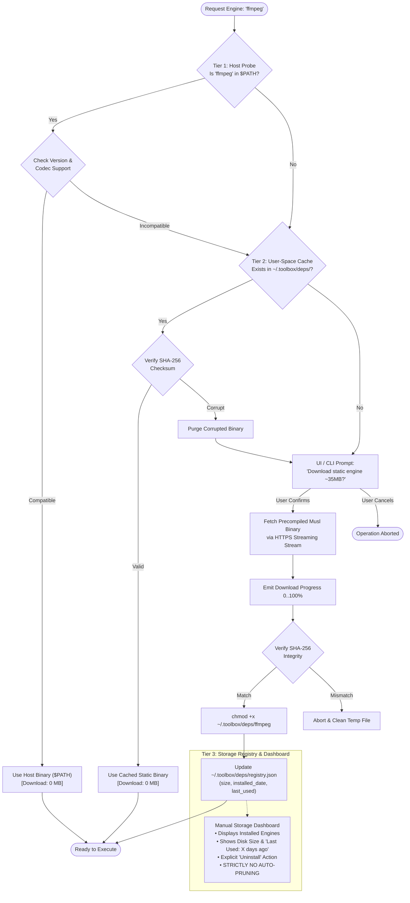
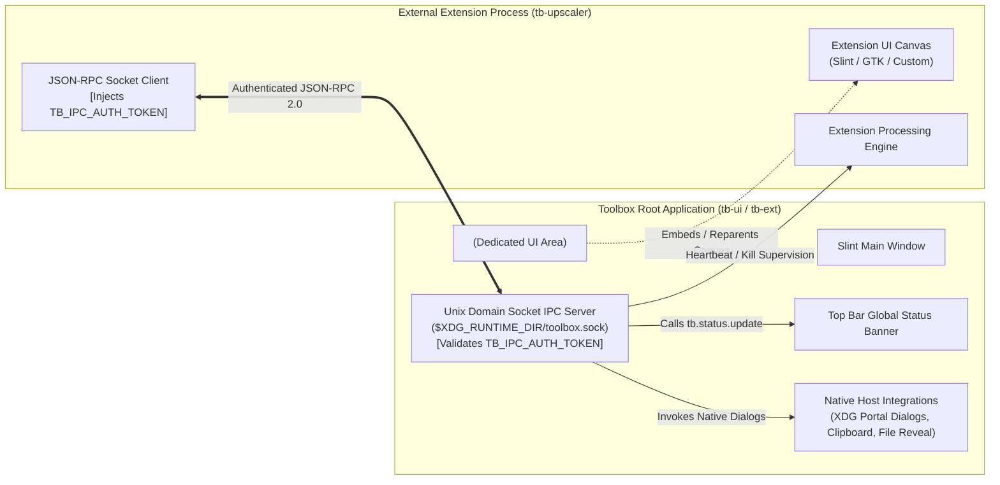
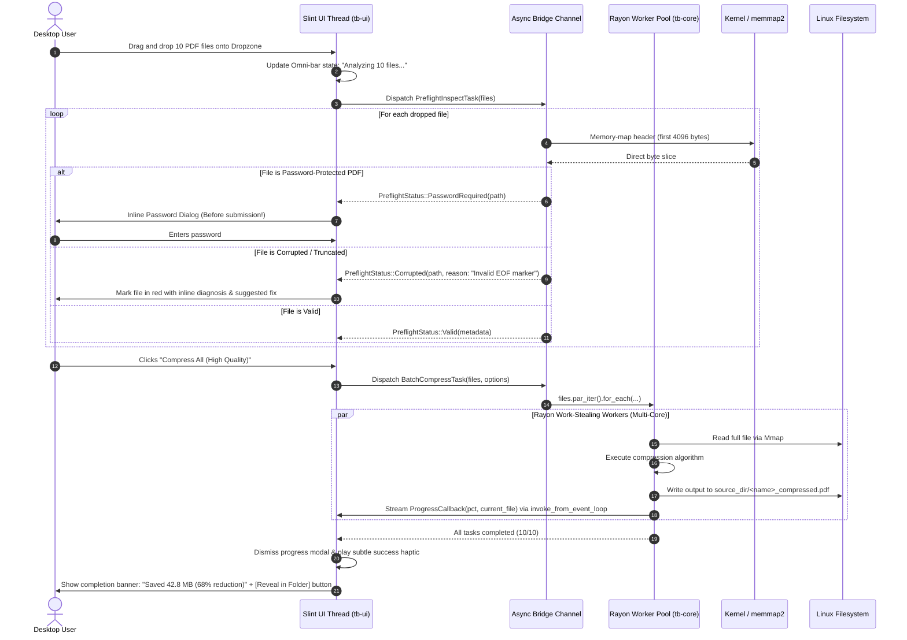
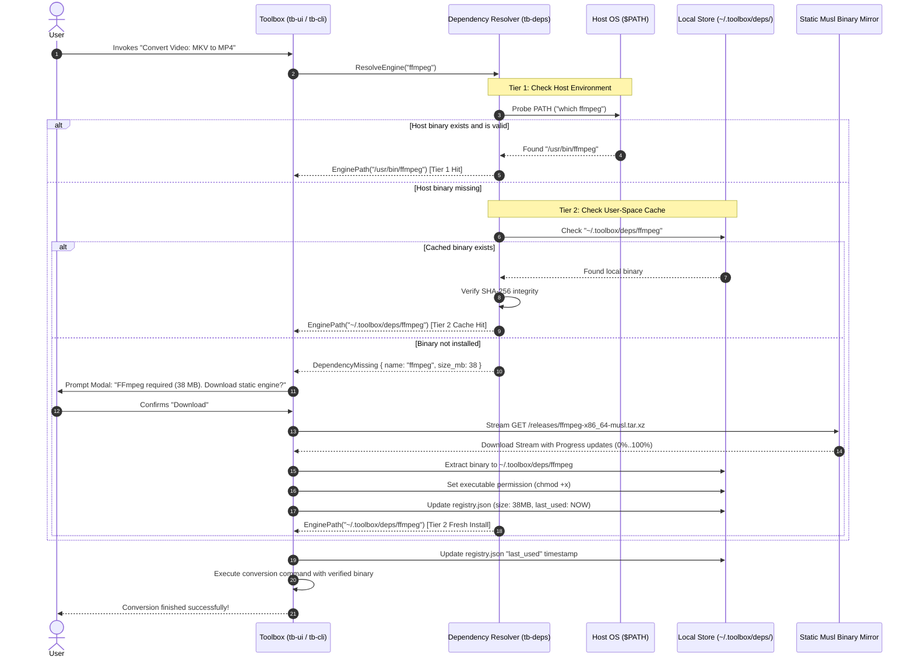
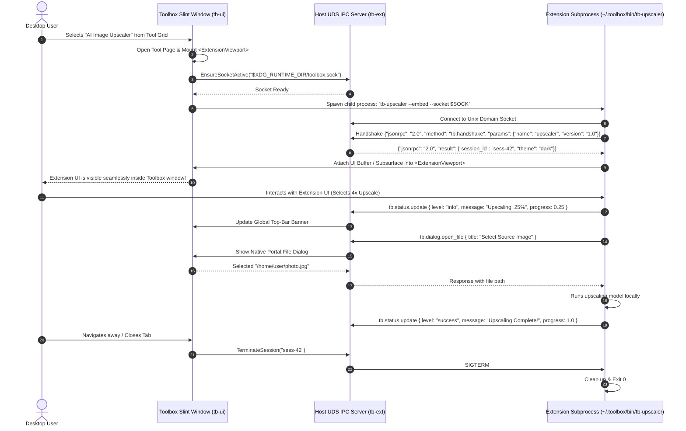
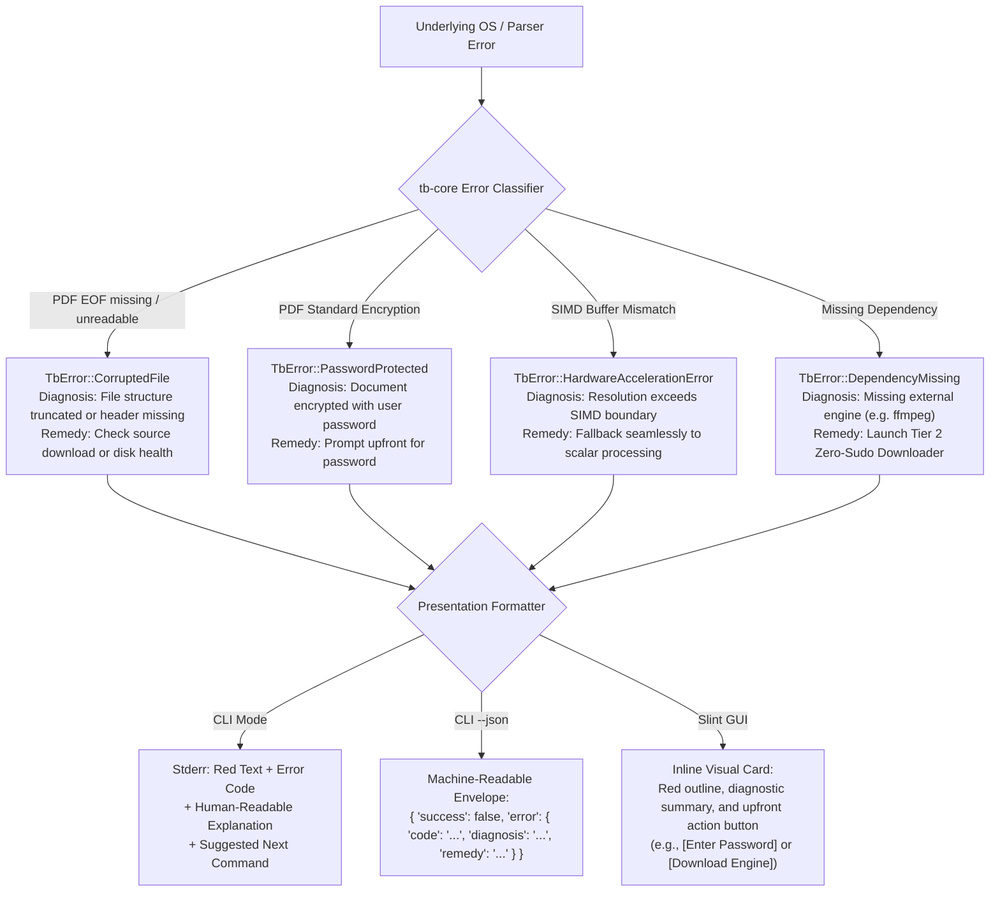

# Architecture Solution Design Explainer — Toolbox (`tb`)

This document serves as the visual and technical companion to [`ARCHITECTURE-SPINE.md`](./ARCHITECTURE-SPINE.md). While the Spine fixes the normative architectural decisions (`AD-1` through `AD-9`), boundaries, and invariant rules, this Solution Design Explainer provides the end-to-end operational models, C4 diagrams, internal component interactions, sequence flows, Unix Domain Socket Host API schemas, and contributor development guides.

---

## 1. System Vision & Architecture Summary

**Toolbox (`tb`)** is engineered as the **"VLC of Digital Utilities"** for the modern Linux desktop: a single, high-performance, privacy-first, 100% offline desktop application and terminal CLI.



---

## 2. C4 Architecture Models

### 2.1 C4 Level 1 — System Context Diagram

The System Context diagram illustrates how Toolbox (`tb`) interacts with the user, local Linux desktop environment subsystems, terminal pipelines, and external resources.



### 2.2 C4 Level 2 — Container Diagram (Cargo Workspace)

Toolbox is structured as a single cohesive repository compiling down into a single multi-call binary `tb` on disk, internally partitioned into decoupled crates.



---

## 3. Component Deep Dive

### 3.1 `tb-core`: Domain Engine Architecture

`tb-core` is a pure Rust library. It contains zero references to `slint`, `clap`, or any presentation logic. It provides deterministic, unit-testable engine services.



#### Performance Mechanics in `tb-core`
1. **Zero-Copy Memory-Mapped Access (`memmap2`) & Advisory Locking**:
   - For all files exceeding 1 MB, `tb-core` avoids `std::fs::read` (which allocates double the file size in heap memory).
   - Instead, files are mapped directly into the process's virtual address space via `memmap2::MmapOptions::map()`.
   - To prevent uncatchable `SIGBUS` panics if another process modifies or truncates the file concurrently, `tb-core` acquires an advisory shared read lock (`flock(LOCK_SH)`).
   - Streaming hash operations (`blake3`) read directly from memory-mapped slices, enabling 3–5 GB/s throughput on NVMe drives.
2. **Dual-Input Pipeline (`InputSource`)**:
   - Because standard input streams and Unix pipes (`FIFO`) cannot be memory-mapped, `tb-core` abstracts input via a unified `InputSource`:
     ```rust
     pub enum InputSource<'a> {
         Mmap(memmap2::Mmap),
         Slice(&'a [u8]),
         Stream(Box<dyn std::io::Read + Send>),
     }
     ```
   - Regular files leverage zero-copy memory maps, while piped `stdin` streams utilize buffered vector chunking (`io::copy`), ensuring seamless compatibility across both CLI shell pipelines and desktop GUI drag-and-drop.
3. **Rayon Work-Stealing Parallelism & Throttled Progress**:
   - Batch operations (e.g., converting 100 PNGs to WebP) use `rayon::prelude::par_iter()`.
   - Work items are queued into lock-free deques across worker threads matching host CPU core counts, completely bypassing the Slint UI thread.
   - To prevent flooding the Slint event loop channel when 50+ files report progress simultaneously, worker threads enforce a **16ms rate-limit** (~60–120Hz display refresh) via atomic timestamp checks (`AtomicU64`) before invoking `slint::invoke_from_event_loop`.
4. **Hardware SIMD Image Resizing**:
   - Rescaling uses `fast_image_resize` with dynamic CPU dispatch (AVX2 on x86_64, NEON on ARM64), speeding up image downscaling by up to 8x compared to scalar resampling loops.

---

### 3.2 `tb-deps`: 3-Tier Managed Dependency Engine

Heavy tools like video/audio transcoding require external engines (e.g. FFmpeg). `tb-deps` guarantees zero root privileges (`sudo`), maximum portability, and complete transparency.



---

### 3.3 `tb-ext`: Extension Viewport & UDS Host API Architecture

To allow third-party developers to contribute tools without bloating the core binary, Toolbox provides an extension mechanism:

1. **Subcommand Process Model**:
   - Any executable in `$PATH` or `~/.toolbox/bin/` named `tb-<extension>` is recognized as an extension.
   - Example: Running `tb upscaler input.png` invokes `~/.toolbox/bin/tb-upscaler`.
2. **Embedded Slint Viewport ("Iframe" Model)**:
   - When launched inside the GUI, the root app reserves an embedded `<ExtensionViewport>` panel.
   - For graphical extensions, Slint provides an embedded container using Wayland subsurfaces / X11 window reparenting or shared memory framebuffers (`shm`), allowing the extension's UI to render cleanly inside Toolbox's window frame.
   - Extensions render their own domain UI and self-report progress/status directly within their viewport.
3. **Authenticated Unix Domain Socket Host API**:
   - Toolbox acts as an IPC server listening on `$XDG_RUNTIME_DIR/toolbox.sock`.
   - **Handshake Authentication:** When launching an extension process, Toolbox generates a cryptographically random session token (`TB_IPC_AUTH_TOKEN`) passed via environment variables. The extension must send this token during the initial `tb.handshake` call. Any connection without a valid token is severed immediately.
   - **Permission Scoping:** Extensions declare permission scopes in `toolbox-extension.json` (e.g. `dialog`, `storage`, `clipboard.write`). Sensitive actions (such as `tb.clipboard.read`) trigger an interactive user consent dialog before returning clipboard data.
   - Extensions communicate over this socket using JSON-RPC 2.0 to access native desktop features, update the global top bar, or query runtime state.



---

## 4. Unix Domain Socket Host API Specification

The Host API enables bidirectional communication between the Toolbox root process and extension child processes over a Unix Domain Socket located at `$XDG_RUNTIME_DIR/toolbox.sock` (fallback: `~/.toolbox/toolbox.sock`).

All communication uses **JSON-RPC 2.0**.

### 4.1 Message Envelope Formats

#### Standard Handshake Request
```json
{
  "jsonrpc": "2.0",
  "id": "req-100",
  "method": "tb.handshake",
  "params": {
    "auth_token": "a8f3b9c24e7d10f854619b0c3a215e98",
    "extension_id": "tb-upscaler",
    "version": "1.0.0"
  }
}
```

#### Standard Method Request Envelope
```json
{
  "jsonrpc": "2.0",
  "id": "req-101",
  "method": "tb.dialog.open_file",
  "params": {
    "title": "Select Image to Upscale",
    "filters": [
      { "name": "Images", "extensions": ["png", "jpg", "webp"] }
    ]
  }
}
```

#### Standard Success Response Envelope
```json
{
  "jsonrpc": "2.0",
  "id": "req-101",
  "result": {
    "paths": ["/home/user/Pictures/sample.png"]
  }
}
```

#### Standard Error Response Envelope
```json
{
  "jsonrpc": "2.0",
  "id": "req-101",
  "error": {
    "code": -32001,
    "message": "User cancelled dialog",
    "data": {
      "reason": "cancelled_by_user"
    }
  }
}
```

---

### 4.2 Comprehensive Host API Method Catalog

| Category | Method | Direction | Description |
| :--- | :--- | :--- | :--- |
| **Process Control** | `tb.process.status` | Root ➔ Ext | Query running extension health, PID, and memory footprint. |
| | `tb.process.kill` | Root ➔ Ext | Send graceful termination request (`SIGTERM`), escalating to `SIGKILL` on timeout. |
| | `tb.process.heartbeat`| Ext ➔ Root | Extension sends liveness ping every 5 seconds to prevent watchdog termination. |
| **Global Status** | `tb.status.update` | Ext ➔ Root | Updates the root app's top-level status bar / toast with progress or completion status. |
| | `tb.status.clear` | Ext ➔ Root | Clears the global status bar notification. |
| **Native Dialogs** | `tb.dialog.open_file` | Ext ➔ Root | Requests Toolbox to show a native Linux file picker via `xdg-desktop-portal`. |
| | `tb.dialog.save_file` | Ext ➔ Root | Requests native file save dialog with default semantic suffix. |
| | `tb.dialog.confirm` | Ext ➔ Root | Requests a native confirmation modal (e.g. before overwriting an existing file). |
| **Filesystem** | `tb.fs.reveal` | Ext ➔ Root | Opens user's default Linux file manager highlighting the generated file (`org.freedesktop.FileManager1`). |
| **Clipboard** | `tb.clipboard.read` | Ext ➔ Root | Reads plain text or image bytes from Wayland/X11 clipboard. |
| | `tb.clipboard.write`| Ext ➔ Root | Writes output text or binary image to Wayland/X11 clipboard. |
| **State Storage** | `tb.storage.get` | Ext ➔ Root | Reads persisted key-value preferences from `~/.toolbox/config/<ext_name>.json`. |
| | `tb.storage.set` | Ext ➔ Root | Writes persistent key-value configuration to disk safely. |

#### Detailed Schema Example: `tb.status.update`
```json
// Request from Extension:
{
  "jsonrpc": "2.0",
  "id": "req-102",
  "method": "tb.status.update",
  "params": {
    "level": "info", // "info" | "success" | "warning" | "error"
    "message": "AI Upscaling: Step 2/4 (50%)",
    "progress": 0.50, // 0.0 to 1.0 (null for indeterminate spinner)
    "closable": false
  }
}

// Response from Root App:
{
  "jsonrpc": "2.0",
  "id": "req-102",
  "result": { "acknowledged": true }
}
```

#### Detailed Schema Example: `tb.fs.reveal`
```json
// Request from Extension:
{
  "jsonrpc": "2.0",
  "id": "req-103",
  "method": "tb.fs.reveal",
  "params": {
    "path": "/home/user/Pictures/sample_upscaled.png"
  }
}

// Response from Root App:
{
  "jsonrpc": "2.0",
  "id": "req-103",
  "result": { "revealed": true }
}
```

---

## 5. End-to-End Sequence Flows

### 5.1 Flow 1: Pre-Flight Inspection & Batch File Conversion

Demonstrates zero-copy inspection, pre-flight password validation, Rayon parallel work-stealing, and UI thread progress isolation.



---

### 5.2 Flow 2: 3-Tier Dependency Resolution Flow (FFmpeg)

Demonstrates the zero-sudo user-space fallback when an engine is not present on the host system.



---

### 5.3 Flow 3: Extension Launch & IPC Lifecycle

Demonstrates how an external binary is spawned, renders inside the Slint `<ExtensionViewport>`, and communicates via the Host API.



---

## 6. Error Taxonomy & Diagnostics

In accordance with PRD FR-6 and Architectural Invariant `AD-9`, Toolbox provides rich, human-readable diagnostics rather than obscure stack traces or generic "Operation Failed" messages.



### 6.1 Standard JSON Error Envelope (CLI `--json`)
```json
{
  "success": false,
  "data": null,
  "error": {
    "code": "TB_PDF_PASSWORD_REQUIRED",
    "message": "The PDF document is password-protected and cannot be parsed without decryption.",
    "file": "/home/user/Documents/statement.pdf",
    "details": {
      "encryption_format": "AES-256-R6",
      "pages_detected": 4
    },
    "suggested_action": "Re-run command with '--password <PASSWORD>' or enter the password in the prompt."
  }
}
```

---

## 7. Developer & Contributor Guide

Toolbox is architected so that new utilities can be added in two ways:
1. **Built-in Micro-Tool**: Added directly into `tb-core` and exposed in `tb-cli` and `tb-ui`.
2. **Community Extension**: Developed in any programming language as a standalone executable interacting via the UDS Host API.

### 7.1 Authoring a Built-in Micro-Tool in `tb-core`

Adding a new tool (e.g. an SVG Optimizer) takes 5 steps:

#### Step 1: Implement Domain Logic in `crates/tb-core`
```rust
// crates/tb-core/src/image/svg_cleaner.rs
use crate::error::TbError;
use std::path::{Path, PathBuf};

pub struct SvgCleanerOptions {
    pub strip_comments: bool,
    pub minify_paths: bool,
}

pub fn clean_svg(input: &Path, output: &Path, opts: &SvgCleanerOptions) -> Result<u64, TbError> {
    // 1. Read input via memmap2 if > 1MB
    // 2. Perform non-destructive cleaning
    // 3. Write to output path (<input>_cleaned.svg)
    Ok(bytes_saved)
}
```

#### Step 2: Register Subcommand in `crates/tb-cli`
```rust
// crates/tb-cli/src/args.rs
#[derive(Subcommand)]
pub enum ImageSubcommands {
    /// Optimize and minify SVG vector graphics
    CleanSvg {
        /// Source SVG file path
        file: PathBuf,
        #[arg(short, long)]
        output: Option<PathBuf>,
        #[arg(long, default_value_t = true)]
        strip_comments: bool,
    },
}
```

#### Step 3: Add Slint Component in `crates/tb-ui`
```slint
// crates/tb-ui/ui/tools/svg_cleaner.slint
import { Button, LineEdit, CheckBox } from "std-widgets.slint";

export component SvgCleanerView inherits VerticalLayout {
    in-out property <string> file-path;
    callback trigger-clean();
    callback copy-cli-command();

    HorizontalLayout {
        Text { text: "SVG Optimizer"; font-size: 18px; }
        Button { text: "Copy CLI Command"; clicked => { root.copy-cli-command(); } }
    }
    DropZone { /* ... */ }
    CheckBox { text: "Strip Metadata & Comments"; checked: true; }
    Button { text: "Optimize SVG"; clicked => { root.trigger-clean(); } }
}
```

#### Step 4: Wire Background Task & CLI Generator in `tb-ui/src/bridge.rs`
```rust
// Background worker invocation with render thread isolation & throttled progress
slint_app.on_trigger_clean(move || {
    std::thread::spawn(move || {
        let res = tb_core::image::svg_cleaner::clean_svg(&path, &out, &opts);
        slint::invoke_from_event_loop(move || {
            // Update UI state with results
        }).unwrap();
    });
});

// Live CLI command generator parity
slint_app.on_copy_cli_command(move || {
    let cmd = format!("tb image clean-svg --strip-comments {} -o {}", path.display(), out.display());
    tb_ui::clipboard::set_text(&cmd);
});
```

#### Step 5: Add Unit & Integration Tests
Add deterministic tests verifying memory mapping with `flock(LOCK_SH)`, error responses on invalid XML, and non-destructive output suffixing.

---

### 7.2 Authoring an External Community Extension

Extensions can be written in Rust, Python, Go, Bash, or C++.

```text
my-toolbox-extension/
├── toolbox-extension.json      # Extension manifest
├── Makefile / Cargo.toml       # Build definition
└── src/
    └── main.py                 # Standalone executable
```

#### Extension Manifest Schema (`toolbox-extension.json`)
```json
{
  "id": "tb-webp-animator",
  "name": "Animated WebP Studio",
  "version": "1.0.0",
  "author": "Community Contributor",
  "description": "Convert video clips or image sequences into animated WebP files.",
  "category": "image",
  "icon": "assets/icon.svg",
  "executable": "bin/tb-webp-animator",
  "has_gui": true,
  "required_engines": ["ffmpeg"],
  "permissions": ["dialog", "status", "fs.reveal"]
}
```

#### Extension Implementation Example (Python with UDS Host API & Auth Token)
```python
#!/usr/bin/env python3
import socket
import json
import os
import sys

SOCKET_PATH = os.environ.get("XDG_RUNTIME_DIR", "/tmp") + "/toolbox.sock"
AUTH_TOKEN = os.environ.get("TB_IPC_AUTH_TOKEN", "")

def call_toolbox(method, params=None):
    client = socket.socket(socket.AF_UNIX, socket.SOCK_STREAM)
    client.connect(SOCKET_PATH)
    payload = {
        "jsonrpc": "2.0",
        "id": "ext-1",
        "method": method,
        "params": params or {}
    }
    client.sendall(json.dumps(payload).encode('utf-8') + b'\n')
    response = client.recv(4096)
    client.close()
    return json.loads(response.decode('utf-8'))

# 1. Initial Handshake with Auth Token
call_toolbox("tb.handshake", {
    "auth_token": AUTH_TOKEN,
    "extension_id": "tb-webp-animator",
    "version": "1.0.0"
})

# 2. Send a global status update to the parent Toolbox UI
call_toolbox("tb.status.update", {
    "level": "info",
    "message": "Generating Animated WebP: 45%",
    "progress": 0.45
})
```

---

## 8. Security, Privacy & Sandbox Boundaries

| Dimension | Architectural Implementation |
| :--- | :--- |
| **Zero Network Telemetry** | `tb-core` does not contain any networking libraries (`reqwest`, `hyper`, etc. are strictly excluded from `tb-core/Cargo.toml`). |
| **Air-Gapped Verification** | 100% of built-in tools function without an internet connection. The UI displays an Air-Gap status badge in the footer; CLI provides `tb doctor --network` to verify zero network socket symbols linked into `tb-core`. |
| **Filesystem Safety** | Toolbox never silently overwrites an input file; the default suffix policy (`<file>_compressed.<ext>`) guarantees non-destructive output. Seekable file inspection is protected by advisory `flock(LOCK_SH)` locks. |
| **Process Isolation** | Third-party extensions run as separate OS child processes with standard user permissions. A crash in an extension does not crash the host `tb` window. |
| **IPC Token Authentication** | Unix Domain Sockets require a per-session random `TB_IPC_AUTH_TOKEN` during handshake. Sockets are created with `0600` permissions owned exclusively by `$USER`. Sensitive methods (`tb.clipboard.read`) mandate interactive user consent. |

---

## 9. Alignment Matrix: PRD Requirements to Solution Design

| PRD Req | Description | Architecture Design Section | Verification Mechanism |
| :--- | :--- | :--- | :--- |
| **FR-1 - FR-4** | Omni-bar search, fuzzy scoring, hotkeys | §2.2 Container Diagram (`tb-ui`) | Slint instant search latency < 16ms |
| **FR-5** | Non-destructive suffix output policy | §3.1 `tb-core` Engine Architecture | File overwrite unit tests |
| **FR-6** | Pre-flight inspection & diagnosis | §5.1 Sequence Flow 1 & §6 Error Taxonomy | Password & corrupted file unit tests |
| **FR-7 - FR-9** | CLI command tree, stream piping, `--json` | §2.2 Container Diagram (`tb-cli`) & §6.1 Envelope | CLI integration test suite with piping |
| **FR-10 - FR-12**| PDF, Image, Archive tools | §3.1 `tb-core` Class Diagram | Conversion benchmark suite |
| **FR-13 - FR-16**| Developer Data Tools (Hash, Base64, JWT) | §3.1 `tb-core` SIMD Mechanics | BLAKE3 throughput benchmark (>3GB/s) |
| **FR-17 - FR-19**| 3-Tier dependency engine & storage | §3.2 Dependency Engine & §5.2 Flow 2 | Simulated missing engine integration test |
| **FR-20 - FR-21**| Extension system & Host API | §3.3 Extension Viewport, §4 IPC Catalog | Mock extension UDS test suite |
| **NFR-1** | Sub-200ms cold start latency | §2.1 Context & §3.1 Zero-Copy | Hyperfine startup benchmark |
| **NFR-2** | Sub-30MB base RAM usage | §3.1 Zero-Copy (`memmap2`) | Heap profiling (Valgrind / DHAT) |
| **NFR-3** | 120 FPS buttery smooth GUI | §3.1 Render Thread Isolation | Wayland frame presentation timing |
| **NFR-5** | 100% Offline core execution | §8 Security & Sandbox Boundaries | Firewall / network namespace unshare test |

---
*End of Architecture Solution Design Explainer.*
