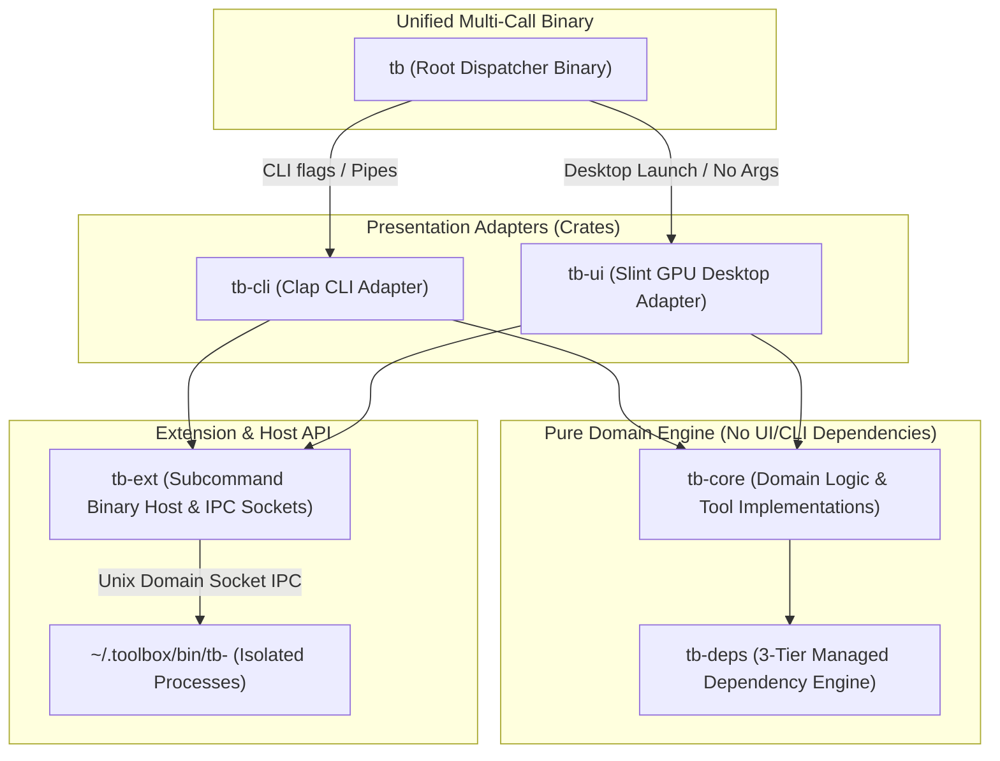

# Architecture Spine — Toolbox (`tb`)

## Design Paradigm

Toolbox uses a **Hexagonal / Layered Architecture** with a **Unified Multi-Call Binary Entry Point** and an **Isolated Host-Plugin Extension Viewport**. The system cleanly separates pure domain logic from presentation frontends (CLI vs. Slint GUI) and isolates external dependencies behind a 3-tier resolution engine.



---

## Invariants & Rules

### AD-1 — Cargo Workspace Crate Boundaries
- **Binds:** All code components.
- **Prevents:** Leaking UI or CLI rendering code into core business logic; prevents circular crate dependencies.
- **Rule:** The project is organized as a Cargo workspace with strict boundary isolation:
  - `tb-core`: Pure library. Strictly forbidden from importing `slint` or `clap`. All engine methods accept clean data inputs and return `Result<T, TbError>`. Completely thread-safe (`Send + Sync`).
  - `tb-deps`: Manages host probing, user-space static binary downloads, checksums, and storage tracking.
  - `tb-ext`: Manages external subcommand process execution and Unix Domain Socket host APIs.
  - `tb-cli`: Terminal adapter. Handles arguments via `clap`, formats standard streams (`stdin`/`stdout`), and emits `--json`.
  - `tb-ui`: Slint GUI adapter. Handles rendering, window state, and worker thread communication.
  - `tb`: The root multi-call wrapper binary.

### AD-2 — Unified Multi-Call Binary Dispatch
- **Binds:** `tb` binary.
- **Prevents:** Distro packaging fragmentation; prevents shipping separate executables for CLI and desktop GUI.
- **Rule:** The project compiles to a single executable: `tb`. At startup, `main()` inspects execution context:
  - If command-line arguments are provided OR `stdin` is piped: dispatches immediately to `tb-cli`.
  - If zero arguments are provided AND a graphical display session (`$WAYLAND_DISPLAY` or `$DISPLAY`) is active, OR invoked with `tb gui`: launches `tb-ui` Slint event loop.

### AD-3 — Zero-Copy Memory-Mapped I/O & Dual Input Pipeline
- **Binds:** `tb-core` file inspection, hashing, and reading routines.
- **Prevents:** High heap memory allocation and slow buffer copying on large files; prevents uncatchable `SIGBUS` crashes if files are concurrently modified; enables non-seekable Unix stdin piping without breakage.
- **Rule:** 
  - For seekable filesystem payloads > 1MB: Reading must use memory-mapped file access via `memmap2::MmapOptions` protected by advisory shared read locks (`flock(LOCK_SH)`). Raw heap copying via `std::fs::read` is forbidden for files > 1MB.
  - For non-seekable inputs (pipes, `stdin` streams): `tb-core` transparently utilizes buffered streaming (`std::io::BufReader` / chunked vector slices), providing unified `InputSource` abstraction across CLI pipes and disk files.

### AD-4 — Work-Stealing Multi-Core Parallelism for Batches
- **Binds:** Batch conversion and compression tasks in `tb-core`.
- **Prevents:** Single-threaded execution bottlenecks when users process multiple files.
- **Rule:** Multi-file operations must utilize `rayon::prelude::*` parallel iterators (`par_iter`), dynamically distributing tasks across available CPU cores via lock-free work stealing without blocking the Slint rendering loop.

### AD-5 — Hardware SIMD Vector Acceleration
- **Binds:** Hashing, parsing, and image processing routines.
- **Prevents:** Inefficient scalar loops on modern CPUs.
- **Rule:** 
  - Cryptographic and integrity hashing must standardize on `blake3` for native AVX-512 / AVX2 / NEON vectorization.
  - Image scaling and resizing must standardize on `fast_image_resize` using hardware SIMD vector instructions.

### AD-6 — Render-Thread Isolation & Throttled Progress Contract
- **Binds:** `tb-ui` and `tb-core`.
- **Prevents:** UI thread blocking, application freeze toasts, event loop message flooding, and frame rate drops below 120 FPS.
- **Rule:** The main thread owns the Slint event loop and is strictly prohibited from executing blocking I/O or computations. Operations execute on background threads and stream progress back using:
  ```rust
  pub type ProgressCallback = Box<dyn Fn(f32, &str) + Send + Sync>;
  ```
  Background workers must rate-limit UI event dispatches to at most once every 16ms per task (~60-120Hz display refresh) using atomic timestamp checks (`AtomicU64`), preventing Slint event queue starvation during high-concurrency Rayon batches. UI updates execute via `slint::invoke_from_event_loop()`.

### AD-7 — Extension Viewport & Authenticated Unix Domain Socket Host API
- **Binds:** `tb-ext` and third-party extensions.
- **Prevents:** Extension crashes bringing down root app; prevents local socket spoofing, token snooping, or unauthorized clipboard siphoning; prevents monolithic code sprawl.
- **Rule:** The root app hosts an IPC server over a Unix Domain Socket (`$XDG_RUNTIME_DIR/toolbox.sock`). Extensions run in separate processes and render their custom interface within the root app's `<ExtensionViewport>` (iframe equivalent). Security and isolation are strictly enforced:
  - **Handshake Authentication:** The parent app injects a cryptographically random one-time session token (`TB_IPC_AUTH_TOKEN`) via process environment variables; unauthorized socket connections without a matching token are severed immediately.
  - **Permission Scoping:** Extensions declare permission scopes in `toolbox-extension.json`. Access to `tb.clipboard.read` mandates explicit user consent.
  - The standard Host API exposes:
    - `tb.process.*` (status, kill, heartbeat)
    - `tb.status.*` (global status bar updates)
    - `tb.dialog.*` (native file open/save dialogs)
    - `tb.fs.*` (reveal in Linux file manager)
    - `tb.clipboard.*` (read/write clipboard)
    - `tb.storage.*` (persistent JSON config at `~/.toolbox/config/<ext>.json`)

### AD-8 — 3-Tier Dependency Engine & User-Space Binaries
- **Binds:** `tb-deps`.
- **Prevents:** Prompting for `sudo`; prevents package manager differences across distros; prevents broken offline workflows.
- **Rule:** Heavy dependencies (e.g. FFmpeg) resolve via:
  1. **Tier 1 (Host Probe):** Check `$PATH` for existing verified binary. If present, use it (0MB download).
  2. **Tier 2 (Static Download):** If missing, download pre-compiled static `musl` binaries into `~/.toolbox/deps/` with zero root privileges, verifying cryptographically pinned compile-time SHA-256 / BLAKE3 hashes. In Flatpak distributions, common runtimes are resolved via Flatpak runtime extensions.
  3. **Tier 3 (Manual Storage Control):** Dashboard records *"Last used"*; deletion is strictly explicit and user-initiated. **Automated background deletion is forbidden.**

### AD-9 — Non-Destructive Suffix Output Policy
- **Binds:** `tb-core` file output operations.
- **Prevents:** Accidental data loss or irreversible source file overwriting.
- **Rule:** All file conversions and compressions save output to the source directory using a semantic suffix (`<name>_compressed.<ext>`, `<name>_converted.<ext>`) by default. If the suffixed target file already exists, GUI increments sequentially (`<name>_compressed (1).<ext>`) while CLI prompts for confirmation unless `--overwrite` / `-f` is explicitly provided.

---

## Consistency Conventions

| Concern | Convention |
| :--- | :--- |
| **Workspace Crate Naming** | Prefix all crates with `tb-` (`tb-core`, `tb-deps`, `tb-ext`, `tb-cli`, `tb-ui`). Root binary is named `tb`. |
| **Error Handling** | `tb-core` and libraries use `thiserror` with typed domain errors. Presentation crates (`tb-cli`, `tb-ui`) use `anyhow` for top-level context handling. |
| **CLI Exit Codes** | `0` = Success; `1` = Operation / Conversion error; `2` = Invalid CLI arguments; `3` = Engine / Dependency missing; `130` = Terminated by user (`SIGINT`). |
| **Machine-Readable Flag** | All CLI subcommands must accept `--json` and output a standardized envelope: `{"success": true, "data": {...}}` or `{"success": false, "error": {...}}`. |
| **GUI-to-CLI Parity** | All GUI tool screens must provide an interactive, real-time `[Copy CLI Command]` button reflecting the exact current GUI configuration for seamless terminal automation. |
| **Filesystem Paths** | Standardize on XDG base directory specification: Config in `~/.config/toolbox/`, dependencies in `~/.local/share/toolbox/deps/` (symlinked `~/.toolbox/deps/`), logs in `~/.local/state/toolbox/logs/`. |
| **IPC Protocol** | Authenticated JSON-RPC 2.0 over Unix Domain Sockets (`$XDG_RUNTIME_DIR/toolbox.sock`). |

---

## Pinned Technology Stack

| Component | Pinned Technology | Purpose |
| :--- | :--- | :--- |
| **Programming Language** | **Rust 2024 Edition (1.82+)** | Core engine, CLI, and GUI implementation |
| **UI Framework** | **Slint 1.8+** | Hardware-accelerated native Linux GUI (Wayland & X11) with software fallback |
| **CLI Argument Parser** | **`clap` 4.5+** (derive) | Type-safe subcommand and argument parsing |
| **Concurrency Pool** | **`rayon` 1.10+** | Work-stealing multi-core parallel file processing |
| **Memory-Mapped I/O** | **`memmap2` 0.9+** | Zero-copy high-throughput file streaming |
| **Cryptographic Hashing** | **`blake3` 1.5+** | SIMD-accelerated 3-5 GB/s cryptographic hashing |
| **Image Acceleration** | **`fast_image_resize` 4.0+** | Hardware SIMD-accelerated image scaling |
| **JSON Serialization** | **`serde` / `serde_json` 1.0+** | High-performance JSON serialization |
| **PDF Operations** | **`qpdf` / `pdfcpu` (static bindings)** | Robust lossless PDF manipulation |
| **IPC & Sockets** | **`interprocess` / `tokio` (UDS)** | Unix domain socket communication for extension host API |

---

## Structural Seed (Cargo Workspace Directory Tree)

```text
toolbox/
├── Cargo.toml                       # Workspace manifest
├── assets/
│   ├── icons/                       # Pre-compiled application icons
│   └── ui/                          # Global Slint themes & shared components
├── crates/
│   ├── tb/                          # Unified multi-call binary entry point
│   │   └── src/main.rs              # Mode detection: CLI vs GUI dispatch
│   ├── tb-core/                     # Pure domain engine
│   │   ├── src/
│   │   │   ├── lib.rs               # Public engine traits & contracts
│   │   │   ├── pdf/                 # PDF merge, split, compress, protect
│   │   │   ├── image/               # Format conversion, oxipng, resize
│   │   │   ├── dev/                 # JSON, JWT, Base64, UUID, Hashes, Regex
│   │   │   └── everyday/            # QR code, Timestamp, Color conversions
│   ├── tb-deps/                     # 3-tier managed dependency engine
│   │   ├── src/
│   │   │   ├── lib.rs               # Dependency resolver
│   │   │   ├── probe.rs             # Host $PATH detection
│   │   │   ├── download.rs          # User-space static binary fetcher
│   │   │   └── storage.rs           # Disk usage & last-used metadata registry
│   ├── tb-ext/                      # Extension system & IPC host
│   │   ├── src/
│   │   │   ├── lib.rs               # Subcommand binary runner
│   │   │   ├── server.rs            # Unix Domain Socket IPC server
│   │   │   └── manifest.rs          # Extension metadata parsing
│   ├── tb-cli/                      # Terminal interface adapter
│   │   ├── src/
│   │   │   ├── main.rs              # CLI entry point
│   │   │   ├── args.rs              # Clap derive argument definitions
│   │   │   └── formatters.rs        # Stream piping and --json output
│   └── tb-ui/                       # Slint desktop GUI adapter
│       ├── ui/                      # Slint markup files
│       │   ├── app.slint            # Main application window
│       │   ├── omni_bar.slint       # Search, dropzone, clipboard bar
│       │   ├── viewport.slint       # Embedded extension viewport container
│       │   └── storage.slint        # Storage & engines dashboard
│       └── src/
│           ├── lib.rs               # Slint window initialization
│           ├── bridge.rs            # Background worker thread channel
│           └── host_api.rs          # Host API handler for extensions
```

---

## Capability → Architecture Map

| PRD Functional Requirement | Implementing Component | Governing Invariant |
| :--- | :--- | :--- |
| **FR-1 to FR-4 (Omni-Bar, Search, Hotkey)** | `crates/tb-ui` (`omni_bar.slint`) | AD-2 (Multi-call binary), AD-6 (Render thread isolation) |
| **FR-5 (Non-Destructive Suffix)** | `crates/tb-core` | AD-9 (Non-destructive suffix policy) |
| **FR-6 (Pre-flight Inspection)** | `crates/tb-core` (`pdf`, `image`) | AD-3 (Zero-copy memory mapping for inspection) |
| **FR-7 to FR-9 (CLI Hierarchy, Pipes, JSON)** | `crates/tb-cli` | AD-1 (Crate boundaries), Consistency Conventions |
| **FR-10 to FR-12 (PDF, Image, Archive)** | `crates/tb-core` | AD-3 (Zero-copy), AD-4 (Rayon batches), AD-5 (SIMD) |
| **FR-13 to FR-16 (Developer Data Tools)** | `crates/tb-core/dev` | AD-5 (BLAKE3 SIMD hashing) |
| **FR-17 to FR-19 (3-Tier Engine & Storage)** | `crates/tb-deps` | AD-8 (3-tier dependency engine) |
| **FR-20 to FR-21 (Extensions & GitHub Install)**| `crates/tb-ext` | AD-7 (Extension Viewport & UDS Host API) |

---

## Deferred Architectural Decisions

1. **Wayland Global Shortcut Protocol Portal (Deferred to v0.4):** Evaluating `xdg-desktop-portal` GlobalShortcuts portal vs. desktop-environment specific D-Bus interfaces.
2. **WebAssembly Extension Execution (Deferred to v1.5):** Wasmtime embedded engine for running sandboxed `.wasm` plugins without spawning separate OS processes.
3. **Hardware Video Encoder Selection (Deferred to v1.0):** Automatic detection of VAAPI vs NVENC for GPU-accelerated video transcoding via FFmpeg flags.
