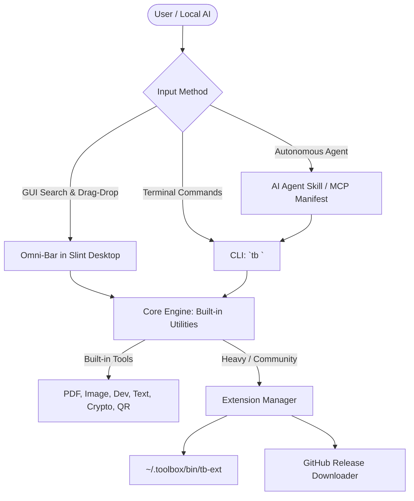

# 🛡️ Toolbox: Product Positioning & Vision

> **Date:** 2026-10-03  
> **Status:** Finalized & Hardened (Post-Elicitation)  
> **Target Platform:** Linux First (Ubuntu, Arch, Fedora, Debian, Alpine, openSUSE)  
> **Core Tech Stack:** 100% Rust + Slint UI Framework  

---

## 1. Executive Summary & Core Positioning

### The One-Liner
**Toolbox (`tb`) is the open-source, 100% offline "VLC of Digital Utilities" — an ultra-fast, native Linux suite that replaces online file converters, formatters, and processors with pure on-device execution.**

```
+-----------------------------------------------------------------------------------------+
|                                        TOOLBOX                                          |
|            "No web uploads. No telemetry. No subscriptions. Just your machine."         |
+-----------------------------------------------------------------------------------------+
                    |                                                 |
                    v                                                 v
        [ Slint Native Desktop App ]                         [ Terminal CLI (`tb`) ]
   - GPU-accelerated with Software Fallback            - Shell Pipes & Standard Streams
   - Never crashes on older hardware or VMs             - Machine-readable JSON for Local AI
                    |                                                 |
                    +-----------------------+-------------------------+
                                            |
                                            v
                   +-------------------------------------------------+
                   |           UNIFIED MONOREPO CORE ENGINE          |
                   |   ~15MB Single Binary with 30+ Core Built-ins   |
                   |   (PDF, Image, Dev, Text, Crypto, QR, Archive)  |
                   +-------------------------------------------------+
                                            |
                                            v
                               [ Optional Heavy Extensions ]
                   - `tb-ocr` (Tesseract language packs)
                   - `tb-video` (FFmpeg encoders)
                   - `tb-ai` (Local LLM / Whisper bridge)
                   - Community Extensions (`tb ext install user/repo`)
```

### The Philosophical Thesis
Millions of people daily search Google for small tasks ("compress pdf", "convert heic to png", "format json", "decode jwt", "remove background") and upload sensitive documents, contracts, tax files, and proprietary code to unknown third-party servers.

Toolbox rejects the SaaSification of basic file and data tasks. It is built in the proud tradition of **VLC, 7-Zip, curl, and Blender**:
* **100% On-Device:** Zero data ever leaves your computer. No network socket permissions required for core operations.
* **Pure Public Good:** Free and open source forever. No corporate paywalls, no "freemium" limits, no artificial restrictions.
* **Bulletproof Reliability:** Written entirely in **Rust** with **Slint** (developed by former Qt Core engineers). It runs on hardware GPU shaders *or* fallback software rendering, guaranteeing it never crashes on older ThinkPads, VMs, or complex Wayland setups.

---

## 2. Core Job to Be Done (JTBD)

### The Emotional Job
> *"Give me total peace of mind and relieve the anxiety/guilt of uploading my personal, financial, or company data to random websites."*

### The Functional Job
> *"Perform any micro-utility task (PDF manipulation, image conversion, video trimming, OCR, formatting, text analysis, cryptography) instantly on my local machine without configuring complex command-line flags or installing 15 separate single-purpose apps."*

### Target User Personas
1. **The Privacy-Conscious User & Professional:** Handles tax returns, legal contracts, medical scans, or family photos and refuses to expose them to cloud scrapers or AI training sets.
2. **The Linux Power User & Developer:** Lives in the terminal, needs fast JSON formatting, Base64/JWT decoding, hash verification, and regex testing without leaving their desktop environment.
3. **The Local AI Agent (Autonomous Consumer):** Local LLMs running via Ollama or local agent runtimes that need a reliable, standard toolset to manipulate files and extract data on behalf of the user.

---

## 3. Product Experience: Dual-Mode Architecture

Toolbox delivers a unified experience across two complementary surfaces:



### Surface A: The Slint Native Desktop Application
* **Framework:** **Slint (Rust)** — lightweight, responsive, and native on both Wayland and X11.
* **Performance Profile:** ~15ms startup time, ~20MB RAM, zero webview/WebKit dependencies.
* **Resilience:** Automatic fallback to software rendering if Vulkan/OpenGL drivers are missing or incompatible (ensuring flawless operation on VMs and older laptops).
* **The Omni-Bar (Content-Aware Input):**
  * **File Dropped (`contract.pdf`):** Immediately presents context-aware PDF actions (*Compress, Extract Pages, OCR, Sign*).
  * **JWT Pasted (`eyJ...`):** Auto-detects token → offers *Decode Payload*.
  * **Raw JSON Pasted:** Auto-detects structured data → offers *Format, Minify, Validate*.
  * **Draft Text Pasted:** Offers *Grammar Check, Word Count, Summarize*.
  * **Keywords Typed (`"heic"`, `"qr"`):** Lightning-fast fuzzy search across all tools (both built-in and external extensions).

### Surface B: The Terminal CLI (`tb`)
* **Core Commands (Zero Extra Downloads):**
  ```bash
  tb pdf compress report.pdf --level high
  tb image convert photo.heic --to webp
  tb dev jwt decode $TOKEN --json
  tb sec hash file.txt --algo sha256
  ```
* **Extension Management for Heavy/Community Modules:**
  ```bash
  tb ext list                         # List installed external tools
  tb ext search ocr                   # Search official registry
  tb ext install ocr                  # Install heavy OCR extension (Tesseract)
  tb ext install github.com/user/tool # Install community extension
  ```
* **Pipe-Native & Machine-Readable:**
  * Accepts standard input: `cat data.json | tb dev format`
  * Emits structured JSON for scripts and agents: `tb dev jwt decode $TOKEN --json`

### Surface C: The Local AI Bridge
* Ships with an out-of-the-box **AI Agent Skill / Tool Manifest** (compatible with Ollama, Claude Desktop, and local agent runtimes).
* Local models do not need to invent Bash commands or write Python scripts: they simply call `tb` subcommands to edit images, read PDFs, or process data safely.

---

## 4. The Extension Ecosystem & Contributor Architecture

To balance zero-setup user convenience with modularity, Toolbox uses a **hybrid BusyBox + Subcommand Architecture**:

### Layer 1: The Built-in Core Suite (Included in Base Binary)
The base `tb` executable (~15MB statically compiled) includes the **top 30 most frequent micro-tools** out of the box:
* **PDF Core:** Merge, split, rotate, password-protect, extract images.
* **Image Core:** Format conversion (JPG/PNG/WebP/HEIC), lossless compression, resize, EXIF strip.
* **Dev Core:** JSON/YAML/TOML formatter, Base64, URL encode, JWT decode, UUID, Hash generator.
* **Text Core:** Case conversion, line deduplication, regex replace, word count, diff.
* **Security & Utility Core:** Password/passphrase generator, checksum verifier, QR code generator/decoder.

### Layer 2: Heavy & Optional Extensions (On-Demand Downloads)
Tools that require heavy language models, huge asset packs, or external binaries are isolated into optional sub-binaries in `~/.toolbox/bin/`:
* `tb-ocr`: Bundles Tesseract engine and language dictionaries (~30MB–100MB).
* `tb-video`: Bundles FFmpeg transcoding and video processing wrappers (~70MB).
* `tb-ai`: Connects to local Ollama / Whisper instances for summarization and transcription.

### Layer 3: Decentralized Community Extensions
* Community developers can publish standalone Rust crates on their own GitHub repos.
* Users can install them directly via CLI or GUI by providing the URL:
  ```bash
  tb ext install github.com/alice/tb-medical-dicom
  ```
* **Safety:** Community extensions display a distinct *Community Extension* badge in the UI.

---

## 5. Technology Stack & Linux Portability Strategy

| Layer | Choice | Rationale |
| :--- | :--- | :--- |
| **Language** | **Rust** (100% end-to-end) | Maximum performance, memory safety, zero garbage collection pauses, static linking capability. |
| **UI Framework** | **Slint (Rust)** | Developed by ex-Qt engineers. Native Wayland/X11, hardware GPU rendering with automatic software-render fallback. Never crashes on older hardware or VMs. |
| **CLI Engine** | `clap` (derive) | Industry standard for ergonomic, blazing-fast terminal flag and subcommand parsing. |
| **Portability** | Static linking via `musl` libc | Single executable runs on Ubuntu, Arch, Fedora, Debian, Alpine, openSUSE with zero library version conflicts. |
| **Packaging** | **AppImage** + **Flatpak** + **AUR** | AppImage gives a single double-clickable executable for any distro; Flatpak sandboxes permissions; AUR serves Arch Linux users. |

---

## 6. Five-Year Vision: The Standard Library for Local AI (2026–2031)

```
[ Year 1: 2026 ]  The Linux Privacy Champion
                  - Core CLI + Slint Desktop launch
                  - 30+ built-in utilities in a single 15MB binary
                  - Marquee heavy extensions: `tb-ocr`, `tb-video`, `tb-ai`
                  - Community adoption on Reddit (r/linux, r/privacy) & Hacker News

[ Year 2: 2027 ]  The Ecosystem Boom
                  - Community extensions for niche file types & data formats
                  - Deep local AI integration (Ollama / Whisper.cpp)
                  - Default inclusion in privacy-focused Linux distributions

[ Year 5: 2031 ]  The Local AI Operating Layer
                  - Hardware NPUs and local LLMs are standard on every laptop
                  - Toolbox serves as the canonical "arms and legs" for local personal AI agents
                  - Zero cloud dependency for personal and enterprise productivity
```

---

## 7. Immediate Next Steps

1. **Technical Architecture Spine (`bmad-architecture`):**
   * Structure the Cargo monorepo workspace (`toolbox-core`, `toolbox-ui`, `toolbox-cli`).
   * Design the Slint UI layout (Omni-Bar, tool views, extension manager screen).
   * Define the IPC interface and JSON output contracts.
2. **Sprint Planning & Core Implementation:**
   * Initialize Rust workspace.
   * Implement the base `tb` CLI dispatcher.
   * Implement the first built-in engines: `pdf`, `image`, and `dev`.
